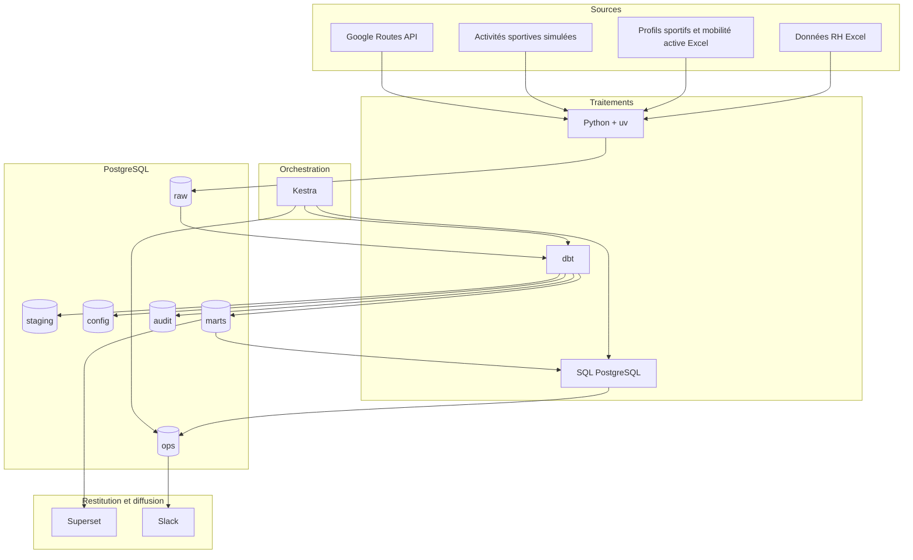
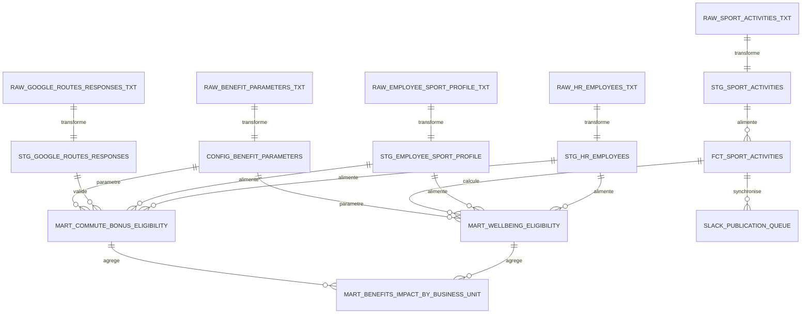

# oc_projet12
# Sport Data Solution

POC d’architecture de données destiné à piloter des avantages salariés liés à la mobilité active et à la pratique sportive.

Le projet couvre l’injection de données RH et sportives, leur transformation avec dbt, leur restitution dans Superset, la publication d’activités dans Slack et l’orchestration d’un flux opérationnel avec Kestra.

---

## Sommaire

1. [Contexte métier](#contexte-métier)
2. [Règles métier implémentées](#règles-métier-implémentées)
3. [Résultats de référence](#résultats-de-référence)
4. [Solution proposée](#solution-proposée)
5. [Architecture technique](#architecture-technique)
6. [Modèle de données](#modèle-de-données)
7. [Prérequis](#prérequis)
8. [Installation et déploiement](#installation-et-déploiement)
9. [Exécution du projet](#exécution-du-projet)
10. [Démonstration de bout en bout](#démonstration-de-bout-en-bout)
11. [Qualité, traçabilité et sécurité](#qualité-traçabilité-et-sécurité)
12. [Limites du POC](#limites-du-poc)

---

# Contexte métier

L’entreprise souhaite piloter deux avantages liés à la pratique sportive et à la mobilité active des salariés :

* une prime annuelle de mobilité active ;
* des jours de bien-être attribués selon la pratique sportive.

Les données disponibles sont :

* un fichier RH contenant les salariés, leur business unit et leur rémunération ;
* un fichier de profils sportifs et de mobilité active déclarée ;
* des activités sportives simulées représentant une future source de type Strava ;
* des distances domicile-travail calculées avec Google Routes ;
* des paramètres métier historisés en base.

L’objectif est de construire une solution automatisée, traçable et démontrable permettant :

1. d’injecter les données ;
2. de les contrôler et les transformer ;
3. de calculer les avantages ;
4. de publier les nouvelles activités dans Slack ;
5. de restituer les résultats dans Superset ;
6. d’orchestrer le flux opérationnel avec Kestra.

---

# Règles métier implémentées

## Prime de mobilité active

Un salarié peut obtenir une prime annuelle lorsqu’il déclare une mobilité domicile-travail active et que son trajet respecte la distance maximale autorisée.

| Mode de déplacement   | Mode Google Routes | Distance maximale |
| --------------------- | ------------------ | ----------------: |
| Marche ou course      | `WALK`             |             15 km |
| Vélo                  | `BICYCLE`          |             25 km |
| Trottinette           | `BICYCLE`          |             25 km |
| Autre mobilité active | `BICYCLE`          |             25 km |

La prime annuelle est calculée selon la formule suivante :

```text
prime annuelle = salaire brut annuel × taux de prime actif
```

Le taux est stocké dans la table de paramètres métier et historisé avec :

* une date de début de validité ;
* une date de fin de validité éventuelle ;
* un commentaire de gestion.

Le scénario de démonstration fait passer ce taux de `5 %` à `6 %`.

## Jours de bien-être

Un salarié peut obtenir des jours de bien-être selon son profil et son activité sportive.

Règles initiales implémentées :

| Paramètre                                        | Valeur initiale |
| ------------------------------------------------ | --------------: |
| Nombre minimal d’activités sur 12 mois glissants |              15 |
| Nombre de jours attribués                        |               5 |

Les paramètres sont historisés dans PostgreSQL afin de permettre une évolution future des règles sans modification du code SQL des marts.

## Publication Slack

Chaque nouvelle activité sportive introduite après la mise en service peut être publiée dans Slack.

La publication est durable :

* l’activité est synchronisée dans une file PostgreSQL ;
* son statut est stocké ;
* le nombre de tentatives est conservé ;
* l’horodatage Slack est conservé ;
* le permalink du message Slack est enregistré ;
* une activité déjà publiée n’est pas renvoyée.

Les activités historiques sont marquées `BACKFILLED` afin d’éviter un rejeu massif dans Slack lors de l’initialisation.

---

# Résultats de référence

L’état initial contrôlé de la démonstration produit les résultats suivants.

| Indicateur                                |       Valeur |
| ----------------------------------------- | -----------: |
| Salariés injectés                         |          161 |
| Profils sportifs injectés                 |          161 |
| Activités sportives simulées              |        2 473 |
| Réponses Google Routes                    |           68 |
| Salariés éligibles à la prime de mobilité |           68 |
| Taux initial de prime                     |          5 % |
| Prime annuelle totale initiale            | 172 482,50 € |
| Salariés éligibles aux jours de bien-être |           85 |
| Jours de bien-être attribués              |          425 |
| Tests dbt                                 |           15 |
| Modèles dbt                               |            9 |

Après révision du taux à `6 %` et injection d’une activité de démonstration datée du 21 juin 2026 :

| Indicateur                    |       Valeur |
| ----------------------------- | -----------: |
| Date de calcul                | 21 juin 2026 |
| Taux appliqué                 |          6 % |
| Salariés éligibles à la prime |           68 |
| Prime annuelle totale         | 206 979,00 € |

---

# Solution proposée

La solution repose sur PostgreSQL comme centre névralgique.

PostgreSQL conserve :

* les données brutes ;
* les paramètres métier ;
* les données transformées ;
* les marts de restitution ;
* la file opérationnelle Slack.

Les transformations métier sont réalisées avec dbt.

Les scripts Python assurent :

* l’injection des données ;
* la simulation des activités sportives ;
* les appels Google Routes ;
* la publication Slack.

Superset restitue les indicateurs métier.

Kestra orchestre le flux opérationnel récurrent.

---

# Architecture technique



---

# Modèle de données

Le modèle est organisé par couches.



## Couches PostgreSQL

| Schéma    | Rôle                                   |
| --------- | -------------------------------------- |
| `raw`     | Données injectées sans logique métier  |
| `staging` | Nettoyage, typage et normalisation     |
| `config`  | Paramètres métier historisés           |
| `marts`   | Tables de restitution métier           |
| `ops`     | État opérationnel de publication Slack |
| `audit`   | Contrôles et anomalies éventuelles     |

## Tables principales

| Table ou vue                                  | Rôle                                      |
| --------------------------------------------- | ----------------------------------------- |
| `raw.hr_employees_txt`                        | Données RH brutes                         |
| `raw.employee_sport_profile_txt`              | Profils sportifs et mobilité active       |
| `raw.sport_activities_txt`                    | Activités sportives simulées ou injectées |
| `raw.benefit_parameters_txt`                  | Paramètres métier historisés              |
| `raw.google_routes_responses_txt`             | Résultats Google Routes mis en cache      |
| `marts.fct_sport_activities`                  | Fait central des activités sportives      |
| `marts.mart_wellbeing_eligibility`            | Éligibilité aux jours de bien-être        |
| `marts.mart_commute_bonus_eligibility`        | Éligibilité à la prime de mobilité        |
| `marts.mart_benefits_impact_by_business_unit` | Synthèse par business unit                |
| `ops.slack_publication_queue`                 | File durable de publication Slack         |

---

# Prérequis

## Poste local

Le projet est prévu pour une exécution locale sous Linux.

Les éléments suivants sont nécessaires :

* Docker Engine ;
* Docker Compose v2 ;
* Python 3.12 ;
* `uv` ;
* accès Internet ;
* un navigateur web ;
* ports locaux disponibles pour PostgreSQL, Superset, pgAdmin et Kestra.

## Services externes

Avant l’installation, il faut disposer :

* d’une clé Google Routes API active ;
* d’un projet Google Cloud avec facturation et quota API configurés ;
* d’un bot Slack disposant du droit `chat:write` ;
* d’un canal Slack dans lequel le bot a été invité.

## Secrets et variables d’environnement

Les secrets ne doivent jamais être versionnés.

Les fichiers locaux nécessaires sont :

```text
.env
infra/kestra/.env
```

Les fichiers d’exemple sont fournis dans le dépôt :

```text
.env.example
infra/kestra/.env.example
```

Les variables principales concernent :

* PostgreSQL ;
* Superset ;
* pgAdmin ;
* Google Routes ;
* Slack ;
* Kestra.

---

# Installation et déploiement

## 1. Cloner le dépôt

```bash
git clone git@github.com:diamonedge/oc_projet12.git
cd oc_projet12
```

## 2. Créer l’environnement Python

```bash
uv sync
```

## 3. Créer le fichier de configuration principal

```bash
cp .env.example .env
```

Renseigner ensuite les variables requises dans `.env`.

Les secrets Google Routes et Slack doivent être présents avant l’injection Google Routes et la publication Slack.

## 4. Générer la configuration Kestra

```bash
bash scripts/00_generate_kestra_env.sh
```

Le script crée `infra/kestra/.env` avec des secrets locaux.

## 5. Démarrer PostgreSQL

```bash
docker compose up -d postgres
```

## 6. Créer les objets PostgreSQL

```bash
bash scripts/01_create_tables.sh
```

Cette étape crée notamment :

* les schémas ;
* les tables ;
* les rôles PostgreSQL ;
* les droits d’accès ;
* les bases de métadonnées Superset et Kestra ;
* la table de file Slack.

## 7. Démarrer les autres services

```bash
docker compose up -d pgadmin superset-init superset
```

Puis démarrer Kestra :

```bash
bash scripts/12_start_kestra.sh
```

## 8. Vérifier les interfaces

| Service  | Adresse locale                          |
| -------- | --------------------------------------- |
| Superset | `http://127.0.0.1:<SUPERSET_HOST_PORT>` |
| Kestra   | `http://127.0.0.1:8080`                 |
| pgAdmin  | `http://127.0.0.1:5050`                 |

Les valeurs exactes doivent être cohérentes avec le fichier `.env`.

---

# Exécution du projet

## Création de l’état métier initial

Le script suivant prépare un état initial entièrement contrôlé :

```bash
bash scripts/13_prepare_controlled_demo_state.sh
```

Il enchaîne :

1. la création idempotente des objets PostgreSQL ;
2. la remise à zéro des données métier ;
3. l’injection RH et profils sportifs ;
4. l’injection des paramètres initiaux ;
5. l’injection des activités simulées ;
6. l’injection des réponses Google Routes ;
7. la construction et les tests dbt ;
8. la synchronisation de la file Slack ;
9. le classement de l’historique Slack en `BACKFILLED`.

Aucun message Slack n’est envoyé par ce script.

## Exécution dbt

```bash
bash scripts/06_check_and_run_dbt.sh
```

Cette commande :

* exécute les modèles dbt ;
* exécute les tests de qualité ;
* reconstruit les marts de restitution.

## Synchronisation Slack

```bash
bash scripts/07_sync_slack_publication_queue.sh
```

La synchronisation utilise un `MERGE` SQL afin d’insérer uniquement les activités absentes de la file durable.

## Prévisualisation Slack

```bash
bash scripts/08_publish_slack_activities.sh --limit 1 --dry-run
```

La prévisualisation ne modifie aucun statut et ne publie aucun message.

## Publication Slack

```bash
bash scripts/08_publish_slack_activities.sh --limit 1
```

Le lot par défaut est configurable avec la variable :

```text
SLACK_PUBLICATION_BATCH_SIZE
```

---

# Démonstration de bout en bout

La démonstration est prévue pour être exécutée depuis un état contrôlé.

## Étape 1 — Remise à zéro

```bash
bash scripts/13_prepare_controlled_demo_state.sh
```

Résultat attendu :

```text
Date de calcul : 2026-06-20
Taux de prime : 0.05
Salariés éligibles : 68
Prime annuelle totale : 172482.50
Activités Slack BACKFILLED : 2473
```

À ce stade :

* les marts dbt sont construits ;
* les tests dbt sont réussis ;
* les activités historiques sont tracées ;
* aucune activité historique n’est publiée dans Slack.

## Étape 2 — Révision du taux de prime

```bash
bash scripts/09_change_bonus_rate_to_six_percent.sh
```

Résultat attendu :

```text
0.05 | 2025-06-20 | 2026-06-20
0.06 | 2026-06-21 |
```

Le taux est historisé ; il n’est pas codé en dur dans les marts.

## Étape 3 — Injection d’une course de démonstration

```bash
bash scripts/10_inject_demo_race.sh
```

Cette étape :

* injecte l’activité `900000001` ;
* positionne sa date au 21 juin 2026 ;
* relance dbt ;
* exécute les 15 tests ;
* applique la version active du taux à 6 %.

Résultat attendu :

```text
Date de calcul : 2026-06-21
Taux de prime : 0.06
Salariés éligibles : 68
Prime annuelle totale : 206979.00
```

## Étape 4 — Publication Slack de la course

```bash
bash scripts/11_sync_and_publish_demo_race.sh
```

Résultat attendu :

```text
MERGE 1
activity_id=900000001
publication_status=PUBLISHED
slack_permalink=https://...
```

La démonstration doit montrer :

* le message dans Slack ;
* le statut `PUBLISHED` dans PostgreSQL ;
* le timestamp Slack ;
* le permalink Slack ;
* l’absence d’erreur dans `last_error`.

## Étape 5 — Orchestration Kestra

Dans Kestra, importer le fichier :

```text
infra/kestra/sport_benefits_operational_pipeline.yaml
```

Lancer le flow avec :

```text
publication_limit = 1
```

Le workflow exécute :

1. le script dbt ;
2. le script de synchronisation Slack ;
3. la prévisualisation du lot Slack.

Le workflow est volontairement exécuté en prévisualisation pour éviter une publication non maîtrisée pendant la démonstration Kestra.

## Étape 6 — Restitution Superset

Afficher le dashboard :

```text
Pilotage des avantages sportifs
```

Les éléments à montrer sont :

* la prime annuelle par business unit ;
* les salariés éligibles à la prime ;
* les salariés éligibles aux jours de bien-être ;
* la synthèse des impacts par business unit.

---

# Qualité, traçabilité et sécurité

## Qualité des données

Les données brutes sont stockées en texte dans `raw`.

Le typage, le nettoyage et les contrôles sont réalisés dans dbt.

Les règles métier sont testées notamment sur :

* les identifiants salariés ;
* l’unicité des salariés dans les marts ;
* les montants de prime ;
* les routes valides ;
* la cohérence entre éligibilité et jours attribués ;
* les valeurs négatives ;
* les enregistrements invalides.

## Traçabilité

La solution conserve :

* le fichier et la ligne source ;
* les paramètres métier et leurs périodes de validité ;
* les réponses Google Routes ;
* les activités injectées ;
* les états de publication Slack ;
* les erreurs de publication ;
* les permaliens Slack.

## Sécurité

Les secrets sont stockés hors du dépôt.

Les rôles PostgreSQL sont séparés entre :

* propriétaire de base ;
* utilisateur applicatif ;
* utilisateur dbt ;
* utilisateur Superset ;
* utilisateur de métadonnées Kestra.

Les droits sont limités selon le rôle.

---

# Limites du POC

Les limites suivantes sont assumées dans le cadre d’un POC local :

* le dashboard Superset est configuré manuellement ;
* les exécutions Google Routes dépendent d’un quota API externe ;
* les activités sportives sont simulées ;
* Kestra utilise des montages de volumes locaux et le socket Docker ;
* ce modèle Kestra est adapté à une démonstration locale, pas à une production ;
* les secrets devraient être externalisés dans un gestionnaire de secrets en environnement de production ;
* les workers Kestra devraient être isolés dans une architecture de production ;
* les données sportives réelles nécessiteraient une analyse RGPD complémentaire.

---

# Structure du dépôt

```text
.
├── data/
├── dbt/
│   └── sport_benefits/
├── docs/
├── infra/
│   ├── kestra/
│   └── superset/
├── scripts/
├── sql/
│   ├── data/
│   ├── init/
│   └── operations/
├── src/
│   └── sport_data_solution/
├── compose.yaml
├── pyproject.toml
├── uv.lock
└── README.md
```

---

# Résumé

Le POC démontre une chaîne de données complète :

```text
Sources → PostgreSQL raw → dbt → marts → Superset
                                      ↓
                                File PostgreSQL
                                      ↓
                                    Slack
                                      ↑
                                   Kestra
```

La base PostgreSQL reste la source de vérité pour les données métier, les paramètres historisés et l’état opérationnel de publication.

